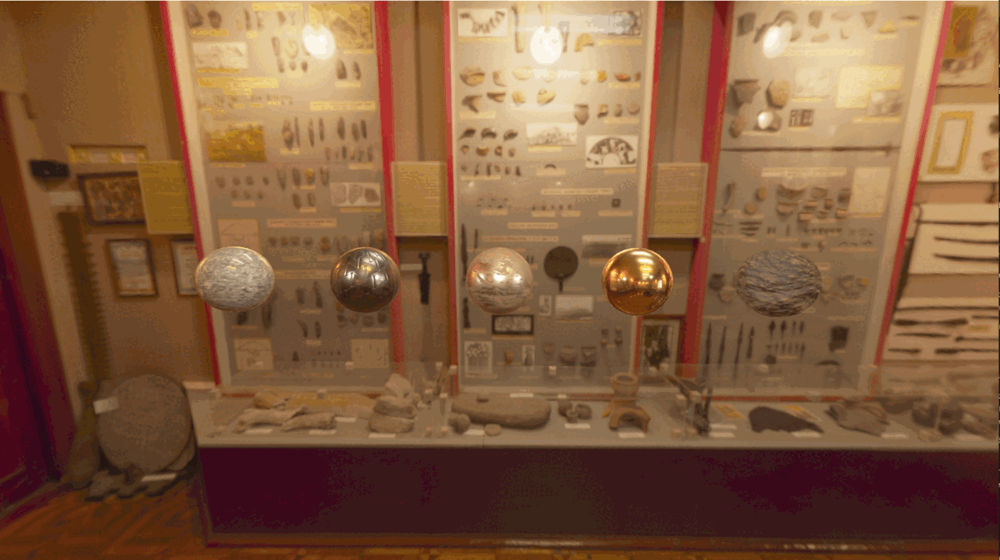
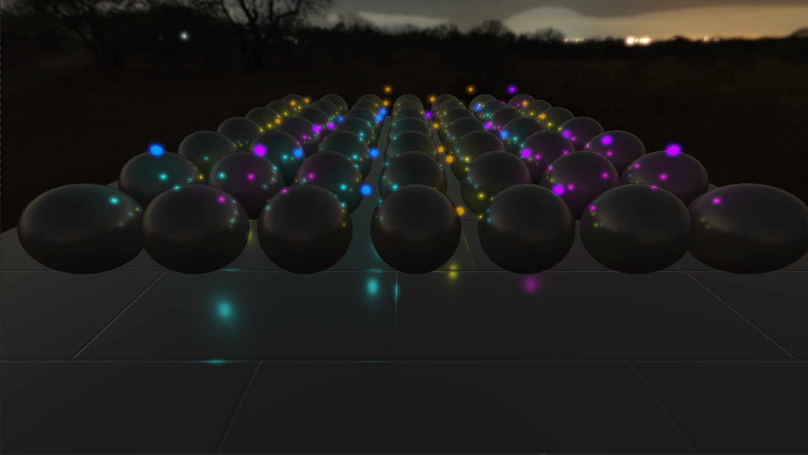

# OpenGLRenderer
An OpenGL renderer.

### Note:
In this project, my goal is to build a renderer using OpenGL. I will try to learn and implement common realtime computer graphics techniques.
Since I am new to computer graphics, I would be happy to receive suggestions about the project and how I can improve myself :).

## Screenshots
  
  
  

## Features:
- PBR (Cook-Torrance specular BRDF)
- IBL
	- Diffuse irradiance
	- Specular
- Deferred shading
- Point light
- Directional light
- Shadows for all light types (shadow map)
- Load objects with assimp
- Forward rendering
- Skybox (.hdr files)
- Post Process
	- Bloom

## Material file read (Probably bad)
- map_Ka	: Metallic map
- map_Kd	: Albedo map
- map_bump: Normal map
- map_Ns 	: Roughness map
- map_d 	: AO map

## Prerequisites
- OpenGL 4.5
- Visual Studio 19 (I haven't tried old versions of Visual Studio)

## Resources
- https://learnopengl.com/
- https://www.youtube.com/c/TheChernoProject
## Models:
- https://www.cgtrader.com/free-3d-models/military/armor/mandalorian-helmet-e1903ae2-3218-43bc-a22c-a102284d230e
- https://www.sharetextures.com/textures/floor/tiling_46/
## HDR Files
- https://polyhaven.com/a/museum_of_ethnography
- https://polyhaven.com/a/entrance_hall
- https://polyhaven.com/a/veranda
- https://polyhaven.com/a/dikhololo_night
- https://polyhaven.com/a/dreifaltigkeitsberg
## PBR Textures
- https://freepbr.com/materials/scuffed-gold-pbr-metal-material/
- https://freepbr.com/materials/gray-granite-flecks1/
- https://freepbr.com/materials/jagged-rocky-ground-pbr/
- https://ambientcg.com/view?id=MetalPlates006
- https://freepbr.com/materials/rusted-iron-pbr-metal-material-alt/

## Note:
There are memory leaks in project (which I assume caused by assimp library), I found no way to fix it. I will check that later since it has cost me so much time.
